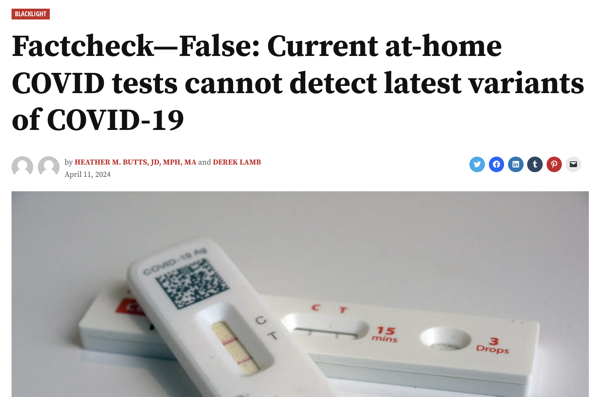

Any scientific insight the goes unshared is meaningless. The collective research process requires dissemination and interrogation of ideas, but this is easier said than done. A key part of effective science communication is understanding your audience, and your relationship to your audience. [Academic publications](research.html) are an effective means of communicating new discoveries and methods within the scientific community, but can't always convey those insights to students, policy-makers, and the public.

Here, I want to highlight my involvement in two different domains of science communication: first, my work in public health journalism to promote public health literacy and address misinformation, and second, my work in science education.

### Media Publications
I work with the [New York Amsterdam News](https://amsterdamnews.com/) as a public health correspondent. I have published a number of articles debunking health misinformation and aim to promote a public understanding of prevailing issues in public health. To read stories that I and my public health peers have written, [visit the AmNews's website](https://amsterdamnews.com/news/tag/blacklight-fact-check/).

<figure>

<figcaption align="center">A factcheck article I published with the NY AmNews.</figcaption>
</figure>

### Education
I have a strong interest in education, and work to engage and teach students about a range of STEM topics. Over the past decade, I have mentored, tutored, and TA'd students in a number of subjects, primarily mathematics and chemistry. These students have ranged from middle school to masters level, and . Currently at Columbia, I TA courses in statistical theory and data science.

I have also done extracurricular engagemen, giving talks [on web design and data science](http://cu-biostats-computing-club.org/resources.html#HTML_and_CSS) for student groups at Columbia.