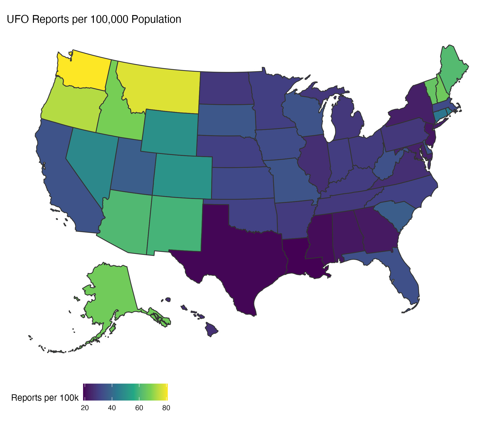
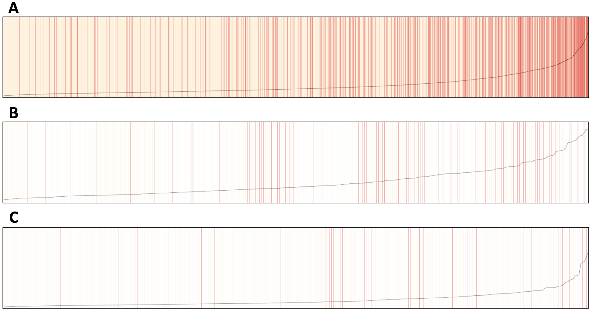

These are a collection of projects I have worked on during the course of my master's program.

### UFO Visualization
I worked with other M.S. Biostatistics students to create [a website](https://nishalingam.github.io/p8105_final-project/index.html) that explores and analyzes reports of UFO sightings. We used data collected by the [NUFORC](https://nuforc.org/) and adapted by [Timothy Renner](https://data.world/timothyrenner) for this project. If you are interested, our [report](https://nishalingam.github.io/p8105_final-project/report.html) summarizes these findings.

<b>Figure 1.</b> A heatmap showing the number of UFO sightings between 1970-2022, normalized by population.

### Breast Cancer Survival

For my final project in Biostatistical Methods 1, I collaborated with two other students to predict risk of death in patients with breast cancer. We built and optimized a logistic regression model and evaluated its performance on different racial groups. Our report is available [here](files/p8130_written_report.pdf).

<b>Figure 2.</b> Separation plots by race. Values are stripes, arranged by increasing predicted probability of death in (A) White, (B) Black, and (C) Other race patients. The stripes are colored yellow if the patient survived, and red if they died. The black line indicates the predicted probability of death.

### Interactive NOAA Dashboard

I made [this dashboard](dashboard.html) as part of my data science course at Mailman. It pulls data from weather stations across the state of New York and displays various pieces of information using the `plotly` and `leaflet` libraries.
