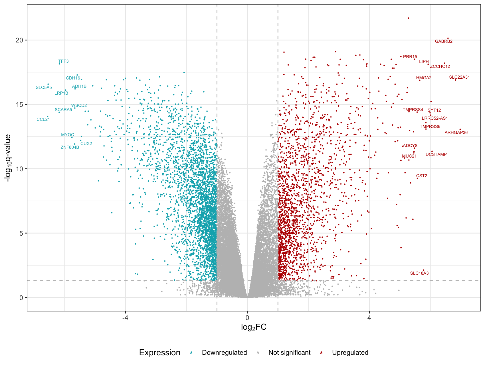
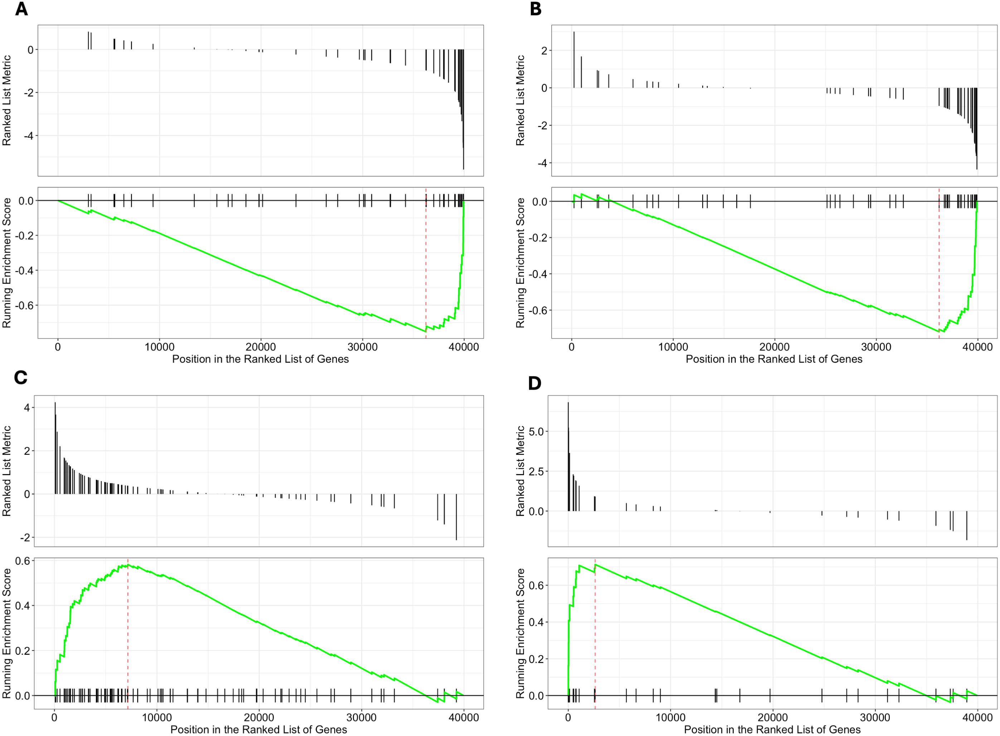

This is a collection of projects I have worked on during the course of my master's program.

### Transcriptomics of Thyroid Cancer

To demonstrate proficiency in statistical genetics and omics analyses, I performed a transcriptome-wide association study (TWAS) coupled with a gene set enrichment analysis (GSEA) on papillary thyroid cancer. I utilized data from [TCGA](https://www.cancer.gov/ccg/research/genome-sequencing/tcga) and identified differentially expressed genes and enriched gene sets. The following figures were created in the course of the project.

<figure>

<figcaption align="center">Volcano plot showing TWAS results. Each dot is a gene product. The grey horizontal line is at a q-value of 0.05, and grey vertical lines are at &plusmn;1. Red genes are upregulated compared to normal tissue, while blue genes are downregulated. The 30 genes with highest differential expression are labelled.</figcaption>
</figure>

<figure>

<figcaption align="center">GSEA plots for the four most enriched gene sets in the TCGA thyroid cancer project. The location of gene set members with log2 fold change (top panel) and the running enrichment score (bottom panel) is shown for <b>A)</b> GO&#58;0035074 (collagen catabolism), <b>B)</b> GO&#58;0031424 (keratinization), <b>C)</b> GO&#58;0035082 (thyroid hormone metabolism), &amp; <b>D)</b> GO&#58;0042403 (axoneme assembly).</figcaption>
</figure>

### UFO Visualization
I worked with other M.S. Biostatistics students to create [a website](https://nishalingam.github.io/p8105_final-project/index.html) that explores and analyzes reports of UFO sightings. We used data collected by the [NUFORC](https://nuforc.org/) and adapted by [Timothy Renner](https://data.world/timothyrenner) for this project. If you are interested, our [report](https://nishalingam.github.io/p8105_final-project/report.html) summarizes these findings.

<figure>

<figcaption align="center">A heatmap showing the number of UFO sightings between 1970-2022, normalized by population.</figcaption>
</figure>

### Breast Cancer Survival

For my final project in Biostatistical Methods 1, I collaborated with two other students to predict risk of death in patients with breast cancer. We built and optimized a logistic regression model and evaluated its performance on different racial groups. Our report is available [here](files/p8130_written_report.pdf).

<figure>

<figcaption align="center"> Separation plots by race. Values are stripes, arranged by increasing predicted probability of death in (A) White, (B) Black, and (C) Other race patients. The stripes are colored yellow if the patient survived, and red if they died. The black line indicates the predicted probability of death.</figcaption>
</figure>

### Interactive NOAA Dashboard

I made [this dashboard](dashboard.html) as part of my data science course at Mailman. It pulls data from weather stations across the state of New York and displays various pieces of information using the `plotly` and `leaflet` libraries.
